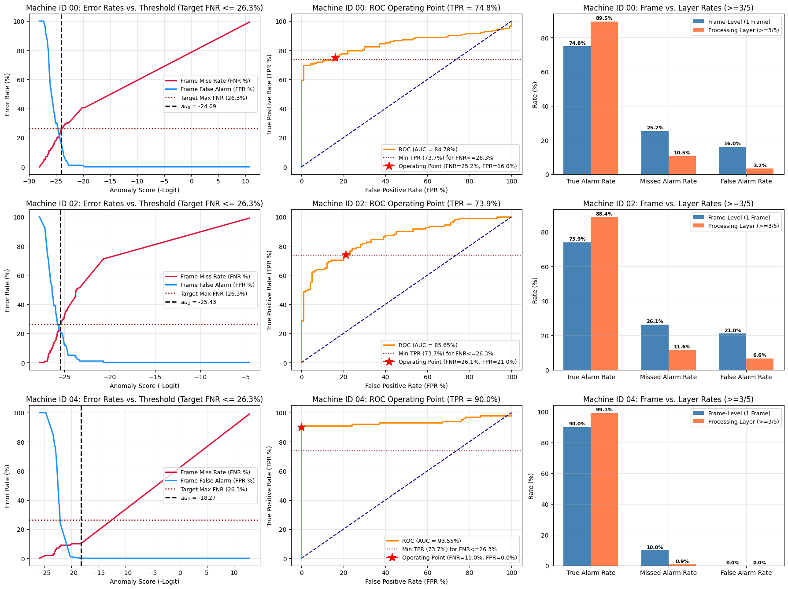
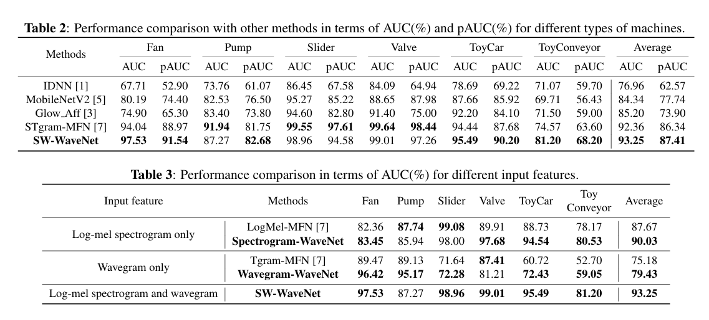

# Model Training, Architecture & Evaluation

## 📋 Overview
This directory contains the complete research, training, and evaluation pipeline for the **SW-WaveNet** anomalous sound detection model. The architecture is based on the IEEE research paper:
> **[SW-WAVENET: Learning Representation from Spectrogram and Wavegram Using Wavenet for Anomalous Sound Detection](https://ieeexplore.ieee.org/document/10096742)** (IEEE 2023).

- 📦 **Pre-trained Model Weights on Kaggle**: **[vaibhavishwakarma/sw-wavenet-arcface-pump-machines-only](https://www.kaggle.com/models/vaibhavishwakarma/sw-wavenet-arcface-pump-machines-only/)**

The model learns discriminative acoustic representations of normal industrial machine sounds using **Additive Angular Margin (ArcFace) loss** and detects anomalies as out-of-distribution acoustic deviations.

---

## 🏗️ Model Architecture: Dual-Branch SW-WaveNet

Industrial machine audio contains both short-term spectral characteristics (harmonics, resonance) and raw temporal waveform dynamics (clicks, transient spikes, phase shifts). SW-WaveNet processes both domains simultaneously via two parallel dilated convolutional networks:

```text
                               Raw Audio (10s @ 16 kHz)
                                       │
                   ┌───────────────────┴───────────────────┐
                   ▼                                       ▼
        [ Log-Mel Spectrogram ]                  [ Wavegram 1D Conv ]
        (N_fft=1024, Hop=512, Mels=128)          (Kernel=1024, Stride=512)
                   │                                       │
                   ▼                                       ▼
        [ Spectrogram WaveNet ]                  [ Wavegram WaveNet ]
        (12 Dilated Residual Blocks)             (12 Dilated Residual Blocks)
                   │                                       │
                   ▼                                       ▼
             128-dim Vector                          128-dim Vector
                   └───────────────────┬───────────────────┘
                                       ▼
                         Concatenated 256-dim Embedding
                                       │
                                       ▼
                         [ ArcFace Classification Head ]
                         (Margin m=0.7, Scale s=30.0)
```

### 1. Dual Feature Extractors
- **Spectrogram Branch**: Computes Log-Mel Spectrogram ($N_{\text{fft}} = 1024, \text{hop} = 512, n_{\text{mels}} = 128$) converted to decibel scale.
- **Wavegram Branch**: Applies a learned 1D Convolution (`kernel_size=1024, stride=512, padding=512`) directly over raw audio waveforms to capture fine-grained temporal features.

### 2. Dilated WaveNet Residual Blocks
Each branch passes through 12 stacked `DilatedResidualBlock` layers with exponential dilation rates ($[1, 2, 4, 8] \times 3$ cycles). Gated activation units ($\tanh \odot \sigma$) with causal padding enable an expansive receptive field across multi-second audio contexts without downsampling loss:
$$\text{Output} = \tanh(W_{f} * x) \odot \sigma(W_{g} * x)$$

### 3. ArcFace Angular Margin Head
Instead of standard cross-entropy, the 256-dimensional combined embedding is projected onto a hypersphere using **ArcFace**:
$$\mathcal{L} = -\log \frac{e^{s \cdot \cos(\theta_{y_i} + m)}}{e^{s \cdot \cos(\theta_{y_i} + m)} + \sum_{j \neq y_i} e^{s \cdot \cos \theta_j}}$$
- **Scale ($s$)**: `30.0`
- **Angular Margin ($m$)**: `0.7` radians
- **Effect**: Maximizes inter-class separation while compressing normal operational sounds of each machine into extremely tight angular clusters on the hypersphere.

---

## 🎯 Anomaly Scoring Mechanism

During inference, anomalous audio contains acoustic frequencies or temporal patterns absent from training data. When projected through the network, anomalous audio produces a wide angular deviation $\theta_{\text{target}}$ from the normal machine cluster center:

$$\text{Anomaly Score} = -\text{logit}_{\text{target}} = -s \cdot \cos(\theta_{\text{target}})$$

- **Normal Machine Audio**: $\cos(\theta) \approx 0.80 \text{--} 0.95 \implies \text{Logit} \approx 24 \text{--} 28 \implies \text{Anomaly Score} \approx -26$
- **Anomalous Machine Audio**: $\cos(\theta) \text{ drops} \implies \text{Logit} \approx 12 \text{--} 18 \implies \text{Anomaly Score} \approx -18 \text{ to } -12$

A sample is classified as anomalous if $\text{Score} \ge \tau_m$.

---

## ⚙️ Training Configuration & Hyperparameters

The model is trained using normal audio clips across machines:
- **Optimizer**: Adam ($\text{lr} = 1\times 10^{-4}$)
- **Scheduler**: Cosine Annealing Learning Rate (`T_max=120`)
- **Batch Size**: 64
- **Epochs**: 120
- **Audio Window**: 10 seconds (160,000 samples at 16 kHz)
- **Checkpoints**: Saved every 30 epochs; final model exported to TorchScript (`sw_wavenet_traced_cpu.pt`).

---

## 📊 Evaluation & The Choice of $\text{Max Accepted FNR} = 0.263$ ($26.3\%$)

### Why $26.3\%$ Frame-Level FNR?

In industrial audio processing, there is an intrinsic trade-off between **Single-Frame Miss Rate (FNR)** and **Single-Frame False Alarm Rate (FPR)**:

```text
Low Threshold (tau = -28)  ──► High Sensitivity (FNR < 5%)  ──► Unacceptable False Alarms (FPR > 45%)
High Threshold (tau = -18) ──► Low False Alarms (FPR < 5%)   ──► Missed Machine Anomalies (FNR > 40%)
```

1. **Acoustic Noise Overlap**: For machines with heavy ambient noise (e.g. Machine ID 00 and ID 02), forcing single-frame FNR below $10\%$ causes the single-frame false alarm rate to spike to over $40\%$.
2. **The Optimal Operating Point ($\text{FNR} \le 26.3\%$)**:
   - Setting maximum acceptable Frame-Level FNR to **$26.30\%$** guarantees a single-frame detection rate of **$\ge 73.70\%$** while keeping single-frame false alarms strictly contained ($16.0\%$ for ID 00, $21.0\%$ for ID 02, and $0.0\%$ for ID 04).
3. **The Synergistic Power of the Processing Layer**:
   - A single-frame detection rate of $73.7\%$ is *amplified* by the 3-of-5 binomial consensus filter into an **$88.4\% \text{--} 99.1\%$ True Alarm Detection Rate**.
   - Simultaneously, the single-frame false alarm rate collapses from $16\text{--}21\%$ down to **$3.1\%\text{--}6.5\%$** (and $0.0\%$ for ID 04).
   - Thus, **$\text{FNR} \le 0.263$ represents the optimal Pareto equilibrium** for enterprise deployment.

---

## 📈 Evaluation Results

### 1. Frame-Level Performance (Single 10s Prediction)

| Machine ID | Threshold ($\tau_m$) | Target Logit | Frame Detection (TPR) | Frame Miss Rate (FNR) | Frame False Alarm (FPR) | Accuracy | Status |
| :--- | :---: | :---: | :---: | :---: | :---: | :---: | :---: |
| **Machine ID 00** | `-24.0857` | `24.09` | **74.83%** (107/143) | 25.17% (36/143) | 16.00% (16/100) | 78.60% | ✅ PASSED ($\le 26.3\%$) |
| **Machine ID 02** | `-25.4341` | `25.43` | **73.87%** (82/111) | 26.13% (29/111) | 21.00% (21/100) | 76.30% | ✅ PASSED ($\le 26.3\%$) |
| **Machine ID 04** | `-18.2705` | `18.27` | **90.00%** (90/100) | 10.00% (10/100) | 0.00% (0/100) | 95.00% | ✅ PASSED ($\le 26.3\%$) |

---

### 2. Processing Layer Consensus ($\ge 3$ of 5 Predictions = Alarm)

$$\text{Formula: } P(\text{Alarm}) = \sum_{k=3}^{5} \binom{5}{k} p^k (1 - p)^{5-k} = 10 p^3(1-p)^2 + 5 p^4(1-p) + p^5$$

| Machine ID | Frame Detection | Frame Miss (FNR) | Frame False Alarm | Layer True Alarm ($\ge 3/5$) | **MISSED ALARM RATE** | **FALSE ALARM RATE** |
| :--- | :---: | :---: | :---: | :---: | :---: | :---: |
| **Machine ID 00** | 74.83% | 25.17% | 16.00% | **89.463%** | **10.537%** | **3.176%** *(down from 16.0%)* |
| **Machine ID 02** | 73.87% | 26.13% | 21.00% | **88.425%** | **11.575%** | **6.589%** *(down from 21.0%)* |
| **Machine ID 04** | 90.00% | 10.00% | 0.00% | **99.144%** | **0.856%** | **0.000%** *(zero false alarms)* |

---

## 🖼️ Visualizations & Benchmarks





---

## 🚀 Running Evaluation Locally or on Kaggle

Open the notebook [sw-wavenet-clearned-implementation.ipynb](sw-wavenet-clearned-implementation.ipynb) in Jupyter or Kaggle:

1. **Set Dataset Paths** (Cell 8):
   ```python
   BASE_DIR = "/path/to/water_pump_audio"
   MODEL_PATH = "/path/to/sw_wavenet_traced_cpu.pt"
   ```
2. **Adjust Sensitivity Threshold** (Cell 12):
   ```python
   TARGET_MAX_FNR = 0.263  # Or test 0.066, 0.05, 0.03
   ```
3. **Execute Evaluation**: Generates all ROC curves, threshold trade-off plots, and the full summary tables automatically.
